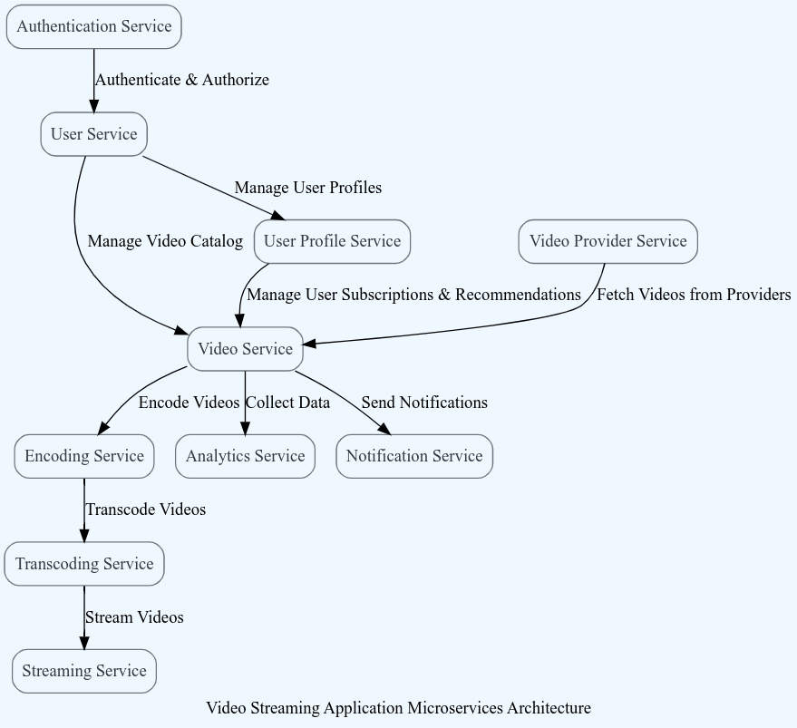

# Tomato :tomato:

# Requirements Refinement

## User Stories

- As a movie enthusiast, I want to search for and stream movies in different languages from various OTT providers, so that **I can enjoy a wide range of movies conveniently from the comfort of my home**.
- As a user who wants to save costs, I want to be able to rent and stream movies from other OTT providers on a pay-per-movie basis through Tomato, so that **I can have access to a larger collection of movies without subscribing to multiple OTT platforms**.
- As a user who wants to watch a specific movie, I want to be able to request that movie on Tomato, and receive a notification when it becomes available for streaming, so that **I can watch the movie I'm interested in without having to constantly check for its availability**.
- As a user who values personalization, I want to receive tailored movie recommendations on Tomato based on my viewing history, ratings, and reviews, so that **I can discover new movies that align with my interests**.
- As a user who wants flexibility, I want to have options for monthly or yearly subscriptions on Tomato, with discounts based on my involvement such as ratings, reviews, etc., so that **I can choose a subscription plan that fits my needs and budget**.
- As an admin or maintenance team member, I want to have access to analytics on Tomato, such as number of users, response time, server utilization, throughput, etc., so that **I can monitor the performance and usage of the platform and make informed decisions for maintenance and improvements**.
- As a user who values privacy, I want Tomato to not store any sensitive data related to me, such as payment information or personal details, so that **my privacy is protected**.
- As a user who wants convenience, I want Tomato to support login from a maximum of 2 devices at a time, so that **I can switch between devices without any inconvenience or security risks**.
- As a user who cares about the environment, I want Tomato to be environment-friendly by using appropriate means to reduce energy consumption or carbon footprint, so that **I can use the platform with a sense of environmental responsibility**.

## Requirements


### Functional Requirements

- **Content Aggregation**: The system should be able to aggregate content from multiple OTT providers' APIs, allowing users to search for and stream movies from different languages, genres, and providers in a unified manner on Tomato.
- **Rent and Streaming**: The system should provide seamless integration with other OTT providers' platforms, allowing users to rent and stream movies from those platforms on a pay-per-movie basis, with secure and reliable payment processing.
- **Movie Request Management**: The system should have a movie request management feature that allows users to request specific movies, and the system should handle the request queue, notifying users when the requested movie becomes available for streaming on Tomato.
- **Personalized Recommendations**: The system should have a recommendation engine that provides personalized movie recommendations to users based on their viewing history, ratings, reviews, and other relevant data, with real-time updates to improve recommendation accuracy.
- **Subscription Management**: The system should support flexible subscription plans, including monthly and yearly options, with the ability to apply discounts based on user involvement (such as ratings, reviews, etc.), and provide easy subscription management features such as upgrades, downgrades, and cancellations.
- **Analytics and Reporting**: The system should have comprehensive analytics and reporting capabilities for admins and maintenance team members to monitor and analyze platform usage, performance metrics (such as response time, server utilization, throughput), and user engagement data, with customizable reports and dashboards for data-driven decision making.
- **Authentication and Device Management**: The system should have robust authentication and authorization mechanisms to ensure that users can only stream content from one device at a time, with secure session management, device tracking, and device deactivation features for user account security and device management convenience.

### Non-Functional Requirements

- **Scalability and Performance**: The system should be able to handle varying workloads, including live streaming of games, movies, and popular series, with high performance and low latency, ensuring smooth and uninterrupted streaming experience for users even during peak usage periods.
- **Privacy and Security**: The system should comply with strict privacy regulations and not store any sensitive data related to users, including payment information or personal details, and should have robust security measures such as data encryption, authentication, and authorization to protect against unauthorized access, data breaches, and other security threats.
- **Reliability and Availability**: The system should be highly reliable and available, with redundant and distributed architecture, automated backups, and disaster recovery measures to ensure minimal downtime and maximum availability of the platform for users.
- **Energy Efficiency and Sustainability**: The system should use appropriate means to minimize energy consumption and reduce the carbon footprint, such as optimizing server utilization, using energy-efficient hardware, and leveraging renewable energy sources, to align with environmental sustainability goals.
- **Usability and User Experience**: The system should provide a user-friendly and intuitive interface for users to easily search, rent, stream, request, rate, and review movies, with seamless navigation, responsive design, and support for different devices and platforms, ensuring a delightful user experience across all touchpoints.
- **Interoperability and Integration**: The system should be interoperable and able to integrate with external APIs of different OTT providers for content aggregation, rental, and streaming, with standardized protocols and data formats, ensuring seamless data exchange and smooth integration with third-party services.
- **Maintainability and Extensibility**: The system should be easy to maintain and extend, with modular and well-documented code, automated testing, version control, and continuous integration and deployment practices, allowing for future enhancements, updates, and bug fixes without disrupting the platform's stability and performance.

## Architectural Significance

From a software architect's perspective, Tomato, as a responsive OTT platform, has several architecturally significant aspects to consider. Firstly, a microservices architecture can be employed to achieve scalability, allowing for independent development, deployment, and scaling of various functional modules such as content aggregation, recommendation engine, subscription management, and user authentication. Additionally, a distributed and redundant architecture can ensure high availability and reliability, with multiple instances of services deployed across different geographical locations, coupled with automated backups and disaster recovery mechanisms.

In terms of performance, content caching and content delivery networks (CDNs) can be utilized to reduce latency and improve streaming quality, ensuring a smooth and uninterrupted user experience. The platform can also leverage containerization and orchestration technologies like Docker and Kubernetes to enable easy deployment, scaling, and management of services in a containerized environment.

From a security perspective, robust authentication and authorization mechanisms should be in place to protect user data and prevent unauthorized access. Data encryption techniques can be used to ensure privacy and compliance with data protection regulations. Regular security audits and vulnerability assessments can help identify and address potential weaknesses in the system.

To provide a personalized user experience, a recommendation engine can be designed using machine learning algorithms, leveraging user data such as viewing history, ratings, and reviews. Real-time updates and feedback loops can continuously improve the accuracy of recommendations. The system should also support multi-device usage with proper session management and device tracking.

However, one potential shortcoming of Tomato could be the content licensing and legal issues associated with content aggregation from multiple OTT providers. Ensuring compliance with copyright laws and licensing agreements would be critical to avoid legal implications. Additionally, the constant evolution of OTT technologies and changing user expectations may require regular updates and enhancements to the platform to stay competitive in the market.

In conclusion, the architecture of Tomato as a responsive OTT platform should prioritize scalability, availability, performance, security, and personalization to deliver a seamless and delightful user experience. Proper consideration of these architectural aspects can have a significant impact on the platform's success, including user retention, engagement, and market competitiveness in the fast-growing OTT industry.

# Tomato

## Description

Tomato is an innovative OTT platform that offers a one-of-a-kind streaming experience to its users. It is aimed at providing a platform to view movies and live streams. These are either from Tomato's own content library or from other OTT providers’ websites (like Netflix, Amazon Prime, Hulu, Disney+).
The platform also consists of a reccomendation system that suggests movies and shows to the user based on their preferences and history.

The services offered on the platform can be accessed through subscriptions and on-rent plans. The platform also continuosly collects data from its users while ensuring privacy and uses it to improve the user experience.

## Subsystems

### 1. The User Interface

The user interface component will be the primary point of interaction between the users and the system.

#### 1.1 Content Library Interface

The content library interface will provide the users with the ability to browse, search, and watch movies.

#### 1.2 User Interface

The user interface will provide the users with the ability to customize their experience on the platform. This includes the ability to change their profile picture, change their password, and change their subscription plan.

#### 1.3 Video Interface

The video interface will provide the users with the ability to watch movies and shows on the platform. This includes the ability to play, pause, and fast forward the video. Like and dislike buttons will also be provided to the user.

### 2. The Content Library Subsystem

#### 2.1 Content Ingestion

This subsystem is responsible for ingesting content from various OTT platforms, including Netflix, Amazon Prime, and Hulu. It uses their respective APIs to fetch and organize the content in a standardized format that can be easily accessed and streamed by the users. This module is designed to handle large amounts of data and can scale horizontally as needed. This subsystem is able to handle the continuous inflow of data from different streaming platforms by implementing a data ingestion module that regularly pulls data from the APIs of the different OTT providers.

#### 2.2 Content Curation

This subsystem is responsible for curating the content in the content library. It is responsible for adding new content to the library, removing content that is no longer available, and updating the metadata of the content.

#### 2.3 Content Delivery

This subsystem is responsible for delivering content to the users in a seamless and uninterrupted manner. It uses multiple CDNs and caching techniques to ensure that the content is delivered quickly and efficiently, regardless of the user's location or device.

### 3. The User Management Subsystem

#### 3.1 User Profile

This subsystem is responsible for managing the user profiles. It is responsible for creating new user profiles, updating existing user profiles, and deleting user profiles.

#### 3.2 User Authentication

This subsystem is responsible for authenticating users. It is responsible for verifying the identity of the user and ensuring that the user is authorized to access the platform. It includes features such as social login, two-factor authentication, and user roles and permissions to ensure the security and privacy of user data.

#### 3.3 User Session Tracker

This subsystem keeps track of user sessions and ensures that only one session is active at a time for each user. This ensures that users can't abuse the system by logging in from multiple devices and using multiple platforms simultaneously.

#### 3.4 Device Management

This subsystem is responsible for managing the devices that are used to access the platform. It is responsible for creating new devices, updating existing devices, and deleting devices and ensuring that only two device is active at a time for each user. This ensures that users can't abuse the system by logging in from multiple devices and using multiple platforms simultaneously.

### 4. Quality of Service Subsystem

This subsystem is responsible for monitoring and optimizing the quality of service (QoS) for each user. It includes features such as adaptive bitrate streaming, buffering, and network optimization to ensure that users have a smooth and high-quality streaming experience.

### 5. Analytics and Reporting Subsystem

This subsystem is responsible for collecting and analyzing data related to platform usage, server utilization, response time, and other metrics. It provides real-time insights to the maintenance team and administrators, enabling them to identify and resolve issues quickly and efficiently.

### 6. Billing and Payment Subsystem

This subsystem is responsible for handling all aspects of billing and payment processing for the platform, including subscription fees, pay-per-view charges, and discounts for active users. It integrates with multiple payment gateways, including PayPal and Stripe, to ensure secure and seamless transactions.

### 7. Intelligence Subsystem

This subsystem is responsible for generating personalized recommendations for each user based on their viewing history, ratings, and other metrics. It uses machine learning algorithms to analyze user behavior and suggest relevant content, including movies, TV shows, and documentaries.

### 8. Advertising Subsystem

This subsystem is responsible for managing advertisements on the platform. It is responsible for displaying advertisements to the users, collecting user data, and using the data to improve the user experience. The Advertising Module is responsible for monetizing the content delivery by displaying advertisements to the users.


# Design Decisions

## Purée: Utilizing Microservices Architecture for Resource-Intensive Workflows

### Status: Accepted :white_check_mark:

### Context

As the architect of the application development team, we are evaluating the best architectural approach for developing resource-intensive workflows that involve complex hierarchical steps and asynchronous serverless functions. Our application, renamed as "Purée", requires a computing platform that can handle high throughput services as well as latency-sensitive workloads, while providing strong contracts, segregated data/dependencies, and scalability.

### Decision

After careful analysis, the decision has been made to adopt a microservices architecture for "Purée" over a monolithic architecture. Microservices architecture provides several advantages, including scalability, flexibility, separation of concerns, and the ability to handle complex workflows and serverless functions. By dividing the logic between APIs, workflows, and serverless functions, we can achieve better organization and modularity, while retaining the strong contracts and segregated data/dependencies of a microservice. This approach will allow us to leverage Docker containers for packaging serverless functions with their media-specific binary dependencies, and scale them based on queue size, to handle computationally intensive tasks efficiently. The use of a microservices architecture will also provide flexibility in choosing the right technologies and tools for each microservice, enabling better development practices and faster time-to-market.

### Consequences

- **Improved Scalability**: Microservices architecture allows for independent scaling of microservices based on demand, which can help in handling high throughput services and resource-intensive workflows more efficiently, ensuring optimal resource utilization.
- **Enhanced Flexibility**: Microservices architecture provides flexibility in choosing technologies, tools, and libraries for each microservice, enabling better development practices and faster innovation, while also facilitating future updates and modifications without impacting the entire system.
- **Better Separation of Concerns**: Microservices architecture enables clear separation of concerns, allowing for better organization and modularity of the application logic, making it easier to understand, develop, test, and maintain, especially in complex workflows involving multiple steps and asynchronous serverless functions.
- **Improved Fault Tolerance**: Microservices architecture allows for isolation and fault containment of microservices, preventing single points of failure and reducing the impact of failures, ensuring higher availability and reliability of the overall system.
- **Enhanced Development Practices**: Microservices architecture encourages the use of DevOps practices, such as continuous integration, continuous delivery, and automated deployments, facilitating better collaboration between development and operations teams, and enabling faster and more reliable software releases.
- **Better Resource Utilization**: Microservices architecture allows for efficient resource utilization, as microservices can be deployed independently based on their specific resource requirements, ensuring optimal resource allocation and utilization, and optimizing costs.
- **Improved Scalability**: Microservices architecture provides flexibility in scaling individual microservices based on their specific workload requirements, allowing for dynamic scaling, and efficient resource utilization, ensuring optimal performance and responsiveness.
- **Enhanced Testability**: Microservices architecture allows for independent testing of each microservice, enabling better unit testing, integration testing, and end-to-end testing, ensuring higher quality and reliability of the overall system.
- **Simplified Deployment and Updates**: Microservices architecture allows for independent deployment and updates of each microservice, without impacting the entire system, reducing downtime and disruptions, and enabling faster delivery of new features and updates.

## Ketchup: Adoption of Containers over EC2 Instances

### Status: Accepted :white_check_mark:

### Context

As the architect of the OTT (Over-The-Top) platform, we are evaluating the best infrastructure approach for hosting and managing our microservices-based applications. Currently, we are using EC2 instances as virtual servers to host our applications. However, we are considering the adoption of containers, specifically Kubernetes, as an alternative approach to improve performance, fault tolerance, concurrency, and availability.

### Decision

After careful evaluation and analysis, the decision has been made to adopt containers (Kubernetes) over EC2 instances for hosting and managing our microservices-based applications on the OTT platform. Containers provide several advantages, including lightweight and portable packaging of applications, easier deployment, scalability, and improved resource utilization. Kubernetes, as a widely adopted container orchestration platform, offers advanced features for managing containerized applications, such as automatic scaling, rolling updates, and self-healing capabilities, which can enhance the performance, fault tolerance, concurrency, and availability of our applications.

### Consequences

The adoption of containers (Kubernetes) over EC2 instances for our OTT platform is expected to have the following consequences:

- **Improved Performance**: Containers provide a lightweight and isolated runtime environment, which can help in optimizing resource utilization and improving the performance of our applications.
- **Enhanced Fault Tolerance**: Kubernetes offers self-healing capabilities, such as automatic container rescheduling and node failure recovery, which can enhance the fault tolerance of our applications, ensuring high availability and reliability.
- **Better Concurrency**: Containers enable efficient isolation and management of microservices, allowing for better concurrency and scalability of our applications, which can help in handling high traffic loads and improving user experience.
- **Increased Availability**: Kubernetes provides advanced features, such as rolling updates and zero-downtime deployments, which can help in maintaining high availability of our applications during updates and deployments, minimizing downtime and disruptions.
- **Simplified Deployment**: Containers provide a standardized packaging format and deployment model, which can simplify the deployment process and enable faster delivery of new features and updates to our applications.
- **Improved Resource Utilization**: Containers allow for efficient utilization of resources, enabling better resource allocation and utilization, which can help in optimizing costs and improving cost-effectiveness.
- **Enhanced Scalability**: Kubernetes provides auto-scaling capabilities, allowing for dynamic scaling of applications based on demand, which can help in handling varying workload requirements and ensuring efficient resource utilization.
- **Enhanced Flexibility**: Containers provide portability and flexibility, enabling easier migration of applications across different environments, such as development, testing, and production, which can facilitate agile development and deployment practices.
- **Better DevOps Practices**: Containerization with Kubernetes can enable better DevOps practices, such as continuous integration, continuous delivery, and automated deployments, which can enhance the agility and efficiency of our development and operations teams.
- **Container Orchestration Complexity**: While Kubernetes provides powerful container orchestration capabilities, it also introduces additional complexity in terms of setup, configuration, and management. This may require additional expertise and resources for designing, deploying, and managing Kubernetes clusters, as well as monitoring and troubleshooting containerized applications.
- **Resource Overhead**: While containers are known for their lightweight nature, they still introduce some overhead in terms of resource utilization compared to EC2 instances. Containers require additional resources for container runtime, container orchestration, and networking components, which may impact overall system performance and resource utilization. Proper monitoring, resource allocation, and scaling strategies need to be in place to efficiently manage containerized applications and avoid resource contention issues.
- **Compatibility and Portability**: Containerization may require re-architecting or re-factoring of applications to run effectively in a containerized environment. Not all applications may be suitable for containers, and some may require modifications or adaptations to run in a containerized environment. Additionally, considerations for container image portability, versioning, and compatibility across different environments (e.g., development, testing, production) may need to be taken into account.
- **Vendor Lock-in**: Adopting Kubernetes or other containerization technologies may introduce vendor lock-in, as it may require reliance on specific containerization platforms, tools, and services. This may limit flexibility and portability in case of future changes in technology or business requirements. Proper vendor evaluation and planning for potential vendor lock-in should be considered as part of the overall architecture design.

## Chutney: Advancing Rapid Development with GraphQL Beyond REST

### Status: Accepted :white_check_mark:

### Context

As part of our OTT platform architecture, we are evaluating different approaches for building microservices to support rapid development and scalability. Traditional RESTful APIs have been widely used in the industry, but we are considering exploring GraphQL as an alternative approach for building microservices. GraphQL offers several advantages, such as flexible and efficient querying, real-time updates, and strong typing, which can potentially enhance our development speed and enable more responsive and personalized user experiences.

### Decision

After careful evaluation, we propose adopting GraphQL as the primary technology for building microservices in our OTT platform architecture. This decision involves transitioning from RESTful APIs to GraphQL APIs for new microservices, and gradually refactoring existing microservices to adopt GraphQL.

### Consequences

Rapid Development: GraphQL's flexible querying capabilities allow clients to request only the data they need, reducing over-fetching and under-fetching of data. This can result in faster development cycles, as frontend and backend teams can iterate independently and efficiently. GraphQL's real-time subscription feature also enables real-time updates, which can enhance the responsiveness of our applications.

- **Improved User Experience**: GraphQL's ability to provide tailored responses based on client requirements can enable more personalized and optimized user experiences. Clients can request only the relevant data, reducing unnecessary data transfers and improving performance. GraphQL's strong typing and introspection capabilities also enable better documentation and tooling, enhancing developer productivity.
- **Microservice Autonomy**: GraphQL allows each microservice to define its own schema and expose only the required data and operations, providing more autonomy to individual microservices. This can enable teams to develop and deploy microservices independently, without tight coupling to the frontend, improving scalability and agility.
- **Learning Curve and Tooling**: Adopting GraphQL may require learning new concepts and tools for both frontend and backend teams. Training and upskilling efforts may be needed to ensure proper understanding and adoption of GraphQL. Additionally, compared to REST, GraphQL tooling and ecosystem may not be as mature, which may require additional effort in evaluating and selecting appropriate libraries, frameworks, and best practices.
- **Backward Compatibility**: Transitioning from RESTful APIs to GraphQL may require refactoring of existing microservices, potentially impacting backward compatibility for existing clients. Careful planning and coordination may be required to ensure smooth migration and minimize disruptions to existing clients.
- **Operational Considerations**: GraphQL introduces additional complexities in terms of caching, authentication, and authorization compared to traditional RESTful APIs. Proper implementation of these operational concerns should be considered to ensure secure and performant microservices.
- **Monitoring and Logging**: Monitoring and logging strategies may need to be updated to capture GraphQL-specific metrics and logs for troubleshooting and performance analysis. Proper monitoring and logging practices should be in place to ensure effective management of GraphQL-based microservices.
- **Ecosystem Maturity**: GraphQL is a rapidly evolving technology with a growing ecosystem, and may not have the same level of maturity and stability as REST. Proper evaluation and selection of GraphQL libraries, tools, and best practices should be done to ensure robustness and reliability in production environments.
- **Security**: GraphQL APIs may introduce new security considerations, such as authorization and authentication at the field level, schema validation, and input validation. Ensuring proper security measures are in place, such as authentication and authorization mechanisms, input validation, and schema validation, is crucial to prevent potential security risks and protect sensitive data in an OTT platform architecture.

## Soup: Prioritizing AP (Availability and Partition Tolerance) in CAP Theorem for System Design

### Status: Accepted

### Context

As the architect of the OTT (Over-The-Top) platform, we are designing our system architecture to handle the challenges of scalability, fault tolerance, and availability in a distributed environment. The CAP (Consistency, Availability, and Partition Tolerance) theorem states that in a distributed database system, it is impossible to achieve consistency, availability, and partition tolerance simultaneously. Given the nature of our microservices-based architecture, which leverages containerization with Kubernetes and GraphQL for API flexibility, we need to prioritize the AP (Availability and Partition Tolerance) aspect of the CAP theorem to ensure robustness, high availability, and smooth operations of our platform.

### Decision

After careful analysis and consideration, we have decided to prioritize AP (Availability and Partition Tolerance) in the CAP theorem for our OTT platform. This decision aligns with our system requirements and architectural goals, which include high availability, fault tolerance, and scalability. By prioritizing AP, we aim to ensure that our system remains operational and accessible even in the face of network partitions or failures, providing uninterrupted service to our users.

### Consequences

- **Improved Availability**: Prioritizing AP means that our system will remain operational and accessible even during network partitions or failures, minimizing downtime and disruptions and ensuring high availability for our users.
- **Enhanced Fault Tolerance**: By prioritizing partition tolerance, we can design our system to tolerate network partitions and failures, enabling fault tolerance and improving the resilience of our platform.
- **Scalability and Flexibility**: AP aligns well with the microservices-based architecture, containerization with Kubernetes, and GraphQL, as it allows for independent and autonomous operation of microservices, enabling scalability, flexibility, and agility in our system.
- **Resilient Operations**: Prioritizing AP ensures that our system can continue to operate and provide services even in the presence of network partitions, failures, or other unpredictable events, reducing the risk of system-wide failures and ensuring smooth operations.
- **Eventual Consistency**: As AP prioritizes availability and partition tolerance over consistency, our system may exhibit eventual consistency, where updates or changes may take some time to propagate across all replicas or partitions. This may require careful handling of data consistency and synchronization in our microservices-based architecture, and potential challenges in ensuring consistent and coherent views of data across the system.
- **Monitoring and Observability**: Prioritizing AP requires robust monitoring and observability practices to detect and resolve any inconsistencies or issues that may arise due to eventual consistency, network partitions, or failures. This may involve implementing appropriate monitoring tools, logging, tracing, and alerting mechanisms to ensure timely detection and resolution of issues, which may pose challenges in terms of complexity and maintenance.
- **Trade-offs with Consistency**: Prioritizing AP may result in eventual consistency, where different replicas or partitions may have slightly different views of data at any given point in time. This may require careful consideration and trade-offs between consistency and availability in our system, and potential challenges in managing data integrity and consistency across the distributed environment.

# Views

## Stakeholders

- **Project Managers**: Concerned with project scheduling, resource allocation, and contingency planning for releasing subsets of the system.
- **Development Team**: Responsible for implementing the architecture and ensuring that the platform meets the quality objectives.
- **Quality Assurance Team**: Concerned with testing and verifying the platform's behavior and performance.
- **Content Providers**: Involved in content acquisition and curation to ensure a diverse and high-quality content library.
- **Business Development Team**: Concerned with monetization and revenue generation strategies, including subscription, rental, and advertising models.
- **Marketing Team**: Responsible for promoting the platform and building user engagement through targeted campaigns.
- **Customers**: Pay for specially commissioned projects and expect high-quality user experiences.
- **End Users**: Expect a smooth and enjoyable viewing experience with relevant recommendations and content.
- **Analytics Team**: Responsible for collecting and analyzing user data to improve the platform's performance and personalization.
- **Billing and Payment Team**: Responsible for managing user payments and generating revenue for the platform.
- **Infrastructure Support Personnel**: Involved in setting up and maintaining the infrastructure that supports the development, build, and production environments of the system.

## Concerns

- **User experience** - Providing a smooth and enjoyable viewing experience to users, including easy navigation, seamless streaming, and relevant recommendations.
- **Content acquisition and curation** - Ensuring a diverse and high-quality content library that caters to users' preferences and interests.
- **Data collection and privacy** - Collecting and analyzing user data to improve the platform's performance and personalization, while also protecting users' privacy.
- **Security and reliability** - Ensuring the platform is secure, stable, and resilient, including measures such as encryption, backups, and disaster recovery.
- **Monetization** - Generating revenue from users and advertisers through subscription, rental, and advertising models.
- **Performance monitoring** - Monitoring the platform's performance and quality of service, including metrics such as uptime, latency, and error rates.
- **Innovation and differentiation** - Staying ahead of competitors by introducing new features, technologies, and services that differentiate the platform and improve its value proposition.

## Traceability Matrix

|      **Concerns/Stakeholders**       | **PMs** | **Dev Team** | **Testers & Integrators** | **Designers of other systems** | **Maintainers** | **App Builders** | **Users** | **Analysts** | **Infra Support** |
| :----------------------------------: | :-----: | :----------: | :-----------------------: | :----------------------------: | :-------------: | :--------------: | :-------: | :----------: | :---------------: |
|         **User experience**          |    X    |      X       |                           |               X                |                 |        X         |     X     |      X       |                   |
| **Content acquisition and curation** |         |              |                           |                                |        X        |        X         |           |              |                   |
|   **Data collection and privacy**    |         |              |                           |                                |        X        |                  |     X     |              |                   |
|     **Security and reliability**     |         |      X       |             X             |               X                |        X        |        X         |           |      X       |         X         |
|           **Monetization**           |    X    |              |                           |               X                |                 |        X         |           |      X       |                   |
|      **Performance monitoring**      |         |      X       |             X             |                                |        X        |        X         |           |      X       |         X         |
|  **Innovation and differentiation**  |    X    |      X       |                           |                                |                 |                  |     X     |              |                   |

This traceability matrix is of utmost importance to us as it helps us to understand the concerns of each stakeholder and how they are related to each other. As and when our architecture evolves, we can refer to this matrix to ensure that we are addressing all the concerns of our stakeholders.

# Architectural Tactics and Strategies

## Considerations

- **Contract creation and maintenance**: In a microservices architecture, each service has its own API and contracts that define how it interacts with other services. These contracts need to be created and maintained to ensure that all services can communicate effectively. In the context of a distributed video streaming OTT platform, this means that contracts need to be created and maintained for services such as video encoding, storage, metadata management, and delivery. The contracts should define the format of video files, data structures for metadata, and communication protocols between services.
- **Contract governance**: In a distributed architecture, there are multiple services developed and maintained by different teams or vendors. It's crucial to establish governance policies and procedures to ensure that contracts are followed and updated according to agreed-upon standards. This helps to prevent service disruptions, conflicts, and data inconsistencies. In the context of an OTT platform, this means that governance policies should be in place to ensure that all services are aligned with the platform's performance, security, and compliance requirements.
- **Remote system availability**: In a distributed architecture, services can be deployed across multiple regions or data centers, and each service may have different availability requirements. Ensuring the availability of all services is crucial to maintaining the platform's reliability and performance. In the context of an OTT platform, this means that services such as video encoding and delivery need to be highly available to ensure that users can access and stream videos without interruptions.
- **Remote access authentication and authorization**: In a distributed architecture, services communicate over the network and may be accessed by multiple clients or users. Ensuring secure access to services is crucial to protect against unauthorized access and data breaches. In the context of an OTT platform, this means that authentication and authorization mechanisms should be in place to ensure that only authorized users or services can access and modify video files, metadata, and other sensitive data. This includes secure access to the platform's APIs and content delivery networks.

## Tactics

### Availability

Because we have opted to prioritize availability and partition tolerance over consistency, in compliance with the CAP theorem, we have chosen to sacrifice consistency. To further enhance the availability of Tomato, we suggest implementing the following strategies to either conceal or fix faults, as proposed by Bass et al. (2013).

|                                                            **Fault Detection**                                                            |                                                     **Fault Recovery**                                                     |                               **Fault Recovery**                               |                                        **Fault Prevention**                                         |
| :---------------------------------------------------------------------------------------------------------------------------------------: | :------------------------------------------------------------------------------------------------------------------------: | :----------------------------------------------------------------------------: | :-------------------------------------------------------------------------------------------------: |
|                                                                                                                                           |                                                  **Preparation & Repair**                                                  |                               **Reintroduction**                               |                                                                                                     |
| Ping / Echo<br>Monitor<br>Heartbeat<br>Timestamp<br>Sanity Checking<br>Condition Monitoring<br>Voting<br>Exception Detection<br>Self-Test | Active Redundancy<br>Exception Handling<br>Rollback<br>Software Upgrade<br>Retry<br>Ignore Faulty Behaviour<br>Degradation | Shadow<br>State Resynchronisation<br>Escalating Restart<br>Non-Stop Forwarding | Removal from Service<br>BASE<br>Predictive Model<br>Exception Prevention<br>Increase Competence Set |

#### Fault Detection

- Ping/echo messages can be used to check if nodes in the network are functional.
- A monitor can be used to keep track of system health.
- Heartbeats can be used to periodically exchange messages between a system monitor and a monitored process.
- Timestamps can be used to detect incorrect sequences of events in message-passing systems.
- Sanity checking can be used at interfaces to check the validity of specific operations or outputs.
- Condition monitoring can be used to prevent the production of faulty behavior.
- Triple modular redundancy can be used for voting to achieve functional redundancy.
- Exception detection can be used to detect system conditions that alter the normal flow of execution.
- Self-tests can be run periodically by components to check themselves.

#### Fault Recovery

- Redundancy can be achieved by clustering nodes into protection groups with active nodes and redundant spares.
- Exception handling can be used to handle domain-driven exceptions.
- Rollbacks can be used to revert to a previously known stable state.
- Upgradability can be ensured in-service without affecting the service.
- Retrying operations can help overcome transient faults.
- Faulty sources can be identified and faulty behavior can be ignored.
- The system can degrade in case of component failure and prioritize critical functions.
- Escalating restarts can be used to minimize impact on the service.
- Non-stop forwarding can be used to decouple the control and data planes.

#### Fault Prevention

- Components can be taken out of service temporarily to prevent system failures.
- NoSQL can be used to follow the BASE guidelines for scalability.
- A predictive model can be used to keep tabs on a process's health.
- Exception prevention can be achieved using exception classes, abstract data types, and wrappers.
- The competence set can be increased by accounting for unlikely occurrences.

### Performance

The objective of performance tactics is to produce timely responses to events that reach the system. In general, the performance scenario can be divided into six variables, as depicted below.

| **Portion of Scenario** |                   **Possible Values**                    |
| :---------------------: | :------------------------------------------------------: |
|   Source of stimulus    |            Internal of external to the system            |
|        Stimulus         |   Arrival of a periodic / sporadic / stochastic event    |
|        Artefact         |    System or a subset of the components in the system    |
|       Environment       | Operational mode: normal, emergency, peak load, overload |
|        Response         |         Process events, change level of service          |
|    Response Measure     |     Latency, deadline, throughput, jitter, miss rate     |

The performance tactics we intend to use are as follows, according to Bass et al. (2013):

|                                                          **Control Resource Demand**                                                          |                                                              **Resource Management**                                                              |
| :-------------------------------------------------------------------------------------------------------------------------------------------: | :-----------------------------------------------------------------------------------------------------------------------------------------------: |
| Manage sampling rate<br>Limit event response<br>Prioritise events<br>Reduce overload<br>Bound execution times<br>Increase resource efficiency | Increase resources<br>Introduce concurrency<br>Maintain multiple copies of computations<br>Maintain multiple copies of data<br>Schedule resources |

#### Control Resource Demand

- Manage sampling rate: We can reduce the sampling frequency of capturing a stream of environmental data, which will reduce the demand on our resources. We can choose different codecs with different sampling rates and data formats to ensure optimal end-user experience.
- Limit event response: To ensure predictable processing when events are actually processed, we can process events only up to a set maximum rate.
- Prioritise events: We can impose a priority scheme that ranks the events according to how important it is to service them.
- Reduce overhead: We can keep intermediaries to a minimum as they increase the resources consumed in processing an event stream. However, they are important for modifiability, so this is a modifiability/performance tradeoff.
- Bound execution times: We can place an upper bound on how much execution time can be devoted to catering to a single event to avoid indefinite computations.
- Improve algorithms: By improving the algorithms used in critical areas, we can decrease latency.

#### Resource Management

- Increase/improve resources: We can identify performance bottlenecks using system diagnostic tools and appropriately upgrade resources such as processors, memory, and networks as the budget permits.
- Introduce concurrency: Processing requests in parallel can reduce blocked time. We can process different streams of events on different threads and create additional threads to process different sets of activities.
- Maintain multiple copies of computations: We can use one-plus-one active redundancy to reduce consensus/fault problems.
- Maintain multiple copies of data: We can use caching to maximise access speeds through a hierarchical memory model. Data will be replicated to resolve conflicts and prevent data loss.
- Schedule resources: Resources such as processors, buffers, and networks will be scheduled using the earliest-deadline-first scheduling strategy.

### Scalability

The need for an improved autoscaling solution arises due to the increasing demand for high-quality video streaming services globally. With the adoption of cloud-based solutions, autoscaling has become a popular choice for scaling resources in response to varying user demands. However, large-scale video streaming platforms like Netflix, Prime, and Hotstar, which cater to millions of users simultaneously, often face issues with traditional autoscaling solutions during sudden spikes in traffic. These spikes can cause a tsunami effect, resulting in increased resource usage and latencies, which traditional autoscaling solutions may not be able to handle. Hence, there is a need for an architectural tactic that can address these issues and improve the overall performance of video streaming platforms.

#### Objective: To handle sudden spikes in traffic and unpredictable user demand in a video streaming platform without incurring high infrastructure costs.

#### Solution: Dynamic autoscaling

- **Data collection**: Collect user traffic and resource utilization data from various sources, such as CDN logs, application logs, monitoring tools, and databases.
- **Data processing**: Analyze the data using machine learning and predictive analytics algorithms to identify patterns and trends in traffic, resource utilization, and user behavior. Develop a prediction model that can forecast traffic demand and resource requirements based on historical data, time of day, day of the week, and other relevant factors.
- **Resource allocation**: Use the prediction model to determine the appropriate number of instances to launch or terminate based on the forecasted demand. Launch additional instances as soon as the traffic starts to increase beyond a certain threshold, and terminate them as soon as the traffic subsides.
- **Load balancing**: Distribute traffic evenly across all instances to avoid overloading any single instance. Use a load balancer that can scale automatically to meet the demand and can route traffic to the most available and optimal instance.
- **Monitoring**: Continuously monitor the performance and health of the instances, and use automated remediation actions to address any issues or failures. Alert the operations team if any instance is underperforming or needs maintenance.
- **Logging and reporting**: Collect and analyze logs and performance metrics to gain insights into the system's behavior, identify any bottlenecks or inefficiencies, and make data-driven decisions for future improvements.

#### Benefits

- **Cost-effective**: The solution can save costs by automatically scaling up or down the infrastructure based on the actual demand, rather than overprovisioning or underprovisioning the resources.
- **Improved user experience**: By handling sudden spikes in traffic and scaling the resources accordingly, the solution can provide a seamless and high-quality user experience, without any buffering or downtime.
- **Scalable and flexible**: The solution can easily adapt to changing traffic patterns and user demand, and can scale up or down the infrastructure as needed, without any manual intervention.
- **Predictive**: By using machine learning and predictive analytics, the solution can forecast traffic demand and resource requirements, and can take proactive actions to prevent any potential issues before they occur.

Overall, the Dynamic Autoscaling with Predictive Analytics tactic can provide a highly scalable, cost-effective, and seamless video streaming platform for users, while also optimizing the infrastructure utilization and minimizing the operational overhead for the operations team.

## Pattern

The proposed architectural solution for the video streaming service involves the adoption of a microservice-based approach, which encompasses several interconnected services, each serving a specific functionality.

- The API Gateway serves as the entry point for client requests, authenticating and authorizing them, and routing them to the appropriate service.
- The User Service manages user authentication and authorization, storing user credentials and performing authentication checks.
- The Video Service manages the video catalogue, storing metadata, handling upload and processing.
- The Encoding Service handles the encoding of video files into different formats and resolutions.
- The Transcoding Service converts video files into different formats suitable for different devices.
- The Streaming Service handles the actual streaming of videos to clients.
- The Analytics Service tracks usage patterns and performance metrics, collecting data about user behavior and system performance.
- The Notification Service sends notifications to users about new videos, comments, and other events.
- The Video Service Provider serves as an interface to interact with various video provider APIs, abstracting their details away from the other services.
- The services are interconnected and orchestrated via the API Gateway to create a robust and scalable microservice architecture to support the video streaming service.

# Architectural Implementation

## Microservice architecture

Our system employs a microservice architecture in which various service providers operate with their individual service handlers, and our platform abstracts the received data from these services into a standardized format. Additionally, we have integrated a video provider service that receives this data and delivers it to end-users. This architecture is designed to enhance scalability and performance by allowing the dynamic scaling of individual components to meet performance demands.



By leveraging microservices, we can achieve a highly modular and loosely coupled design, which enables us to scale our system in a more granular and efficient manner. The microservices provide independent functionality and can be individually managed, monitored, and scaled, which significantly simplifies the maintenance and deployment of our platform.

Our video provider service operates as a gateway between the service providers and the end-users, where it receives all data in a standardized format and processes it for delivery. This approach enables us to seamlessly integrate additional video providers into our platform since each provider is responsible for converting its data to the same format as the other providers, making their integration more manageable.


Furthermore, our system's performance is enhanced through the use of load balancing techniques, which evenly distributes traffic across our microservices, allowing for better resource utilization and improved response times. This approach enables us to handle spikes in traffic and ensures that our system remains highly available and responsive to end-users' needs.

## Containers (Docker + Kubernetes)

Our team leveraged Docker containerization technology to streamline the deployment of our application. By containerizing our application, we were able to isolate each service into its own container, enabling us to deploy multiple instances of our services independently in separate containers. This approach allowed us to easily scale our application up or down as per the demand without any disruption to the other services running in the same environment.

Furthermore, the modular architecture of Docker containers enabled us to easily fine-tune the performance of each service by adjusting the resources allocated to each container independently. This level of control over the deployment environment helped us to optimize the application's performance, and ensure that each service could perform at its optimal level.


The use of Docker containers also simplified the process of deploying and managing our application, as it enabled us to package all of the application's dependencies into a single container image. This approach streamlined our release process and reduced the risk of version conflicts and dependency issues.

## Graphql

We used Graphql instead of REST API's for our architecture. As we discussed above already, this allows us to specify exactly what data we need in a single request, reducing the number of round-trips and improving performance. It also helps with video service discovery and their integration.

Starting with REST API and then integrating GraphQL later on when the application scales up has several advantages.

Firstly, RESTful APIs are easy to understand, and they have been around for a long time, so there is a lot of documentation and tooling available. This makes it easier to get started quickly and develop the application faster.

Secondly, REST APIs can be optimized for performance using techniques like caching and load balancing. This makes them suitable for smaller applications that do not require the complexity and flexibility of GraphQL.

Lastly, as the application scales up, GraphQL can be integrated to provide more flexibility in data querying and manipulation. This can help to reduce the number of API calls and improve performance, while also making it easier for clients to request the data they need in a single request.

To convert the REST implementation to GraphQL, we need to define a schema that represents the data and operations of our API. Here is one possible schema for the given REST implementation:

```json
type Query {
  providers: [Provider!]!
  provider(name: String!): Provider
  video(provider: String!, filename: String!): Video
  thumbnail(provider: String!, filename: String!): Thumbnail
}

type Provider {
  name: String!
  videos: [Video!]!
  thumbnails: [Thumbnail!]!
}

type Video {
  id: ID!
  title: String!
  filename: String!
}

type Thumbnail {
  id: ID!
  filename: String!
}
```

With this schema, we can define the resolvers that implement the functionality of our API:

```js
const resolvers = {
  Query: {
    providers: () => Object.keys(providers).map((name) => ({ name })),
    provider: (parent, args) => {
      const provider = providers[args.name];
      return provider ? { name: args.name, ...provider } : null;
    },
    video: (parent, args) => {
      const provider = providers[args.provider];
      return provider
        ? provider.videos.find((v) => v.filename === args.filename)
        : null;
    },
    thumbnail: (parent, args) => {
      const provider = providers[args.provider];
      return provider
        ? provider.thumbnails.find((t) => t.filename === args.filename)
        : null;
    },
  },
  Provider: {
    videos: (parent) =>
      parent.videos.map((video) => ({ ...video, provider: parent.name })),
    thumbnails: (parent) =>
      parent.thumbnails.map((thumbnail) => ({
        ...thumbnail,
        provider: parent.name,
      })),
  },
  Video: {
    id: (parent) => `${parent.provider}-${parent.id}`,
  },
  Thumbnail: {
    id: (parent) => `${parent.provider}-${parent.id}`,
  },
};
```

We can then use the graphql and express-graphql packages to create a GraphQL server:

```js
const { graphqlHTTP } = require("express-graphql");
const { makeExecutableSchema } = require("@graphql-tools/schema");

const schema = makeExecutableSchema({
  typeDefs: /_ schema definition _/,
  resolvers: /_ resolver functions _/,
});

app.use(
  "/graphql",
  graphqlHTTP({
    schema,
    graphiql: true,
  })
);
```

This creates a GraphQL endpoint at /graphql and enables the GraphiQL IDE for testing and exploring the API. We can now query the API using GraphQL syntax:

```js
query {
  providers {
    name
  }
  provider(name: "Marvel") {
    name
    videos {
      id
      title
      filename
    }
    thumbnails {
      id
      filename
    }
  }
  video(provider: "Marvel", filename: "ironman.mp4") {
    id
    title
    filename
  }
  thumbnail(provider: "Marvel", filename: "ironman.jpg") {
    id
    filename
  }
}
```

## Availability and Partition Tolerance

Microservice architectures are inherently fault-tolerant, with each service designed to be independently deployable and replaceable. Since each service is designed to be independent and can operate even if other services are not available, the overall system can continue to operate even if network partitions occur. Also, if a service fails, other services can continue to operate. This will ensure the availability of the application to the users.

# Architectural Evaluation

- Part of the system being analyzed: Video content providing part of the system
- Quality attributes being analyzed: Availability, performance, and scalability
- Comparison pattern used: Microservice architecture vs. Service-Oriented Architecture (SOA) with a service registry
- Results of the analysis
  - Availability
    - Microservice architecture: When one service fails, it does not affect other services or the whole application
    - SOA architecture: One service failure can cause a cascade of failures due to the dependency on the ESB.
  - Scalability
    - Microservice architecture: Allows for dynamic scaling of individual components according to load, whereas SOA requires scaling the whole application or ESB which is costly and inefficient.
  - Performance
    - Microservice architecture: Provides faster response times and lower latency by avoiding the overhead of the ESB.
    - SOA architecture: Performance is slower due to the ESB's overhead.
  - Security
    - Microservice architecture: Allows for fine-grained access control and encryption mechanisms for each service, enhancing the security of the video streaming service.
    - SOA architecture: Cannot provide fine-grained security mechanisms for each service.
- Inference from the analysis: Microservice architecture is better suited for the application as it provides better availability, scalability, performance, and security than SOA.
